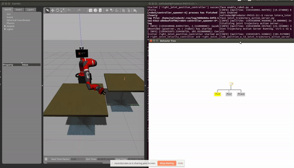

# jarvis

## Dependencies 
Tested on:
- Ubuntu 16.04 LTS
- ROS Kinetic 
- OpenCV 3.4.2 (C++)
- MoveIt 0.9.18-1
- [Sawyer Simulator/Intera SDK](https://github.com/RethinkRobotics/sawyer_simulator) v5.3.0   
- [CUDA](https://developer.nvidia.com/cuda-10.0-download-archive) 10.0
- [OpenPose](https://github.com/CMU-Perceptual-Computing-Lab/openpose) v1.6.0
- NVIDIA Driver v440.64.00
- [ROS-Behavior-Tree](https://github.com/miccol/ROS-Behavior-Tree)

## Human Action Recognition 

## Behavior Tree Execution

